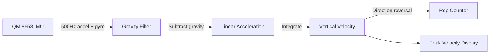

<p align="center"></p>

<br />


> **Lyft**: a wearable velocity-based training tracker built for powerlifters. Clip it to your barbell via magnets, hit start and get real-time feedback on your speed, rep count and set duration.  

*Brought to you by Impossible Labs :)*

## Why another tracker

```
Most trackers are made for runners and don't pick the right metrics that lifters care about!
```

Bar speed is one of the best indicators of fatigue and effort in strength training. When the bar slows down, you're getting closer to failure. Lyft gives you that data instantly, so you can autoregulate your training, stop before burnout, or push when you've got more in the tank.

## Features

- Real-time **peak velocity** display in m/s
- Automatic **rep counting** via motion reversal detection
- **Set timer** that starts when you move
- **Adjustable sensitivity** for heavy singles to fast accessories
- **Sleep mode** for all-day battery life
- **Audio feedback** with configurable volume (start/stop sounds)
- **BLE data sync** to export workout logs to your phone
- **Workout logging** with timestamped session data (CSV format)
- **RTC clock** for accurate timestamps

## How it works

It uses the WaveShare ESP32 C6 1.83" display module. 



The device samples a 6-axis IMU at 500Hz. A low-pass filter continuously tracks gravity while stationary, allowing acceleration to be projected onto the true vertical axis regardless of how the device is mounted. Integration yields velocity, which is corrected using *Zero-Velocity Updates* (ZUPT) whenever the bar is still. Reps are detected by tracking direction reversals—when velocity flips from negative to positive, that's one rep.

---

## Hardware

| Component | Part |
|-----------|------|
| MCU | ESP32-C6 (Wi-Fi 6 + BLE 5) |
| Display | 1.83" ST7789 LCD (240×284, touch) |
| IMU | QMI8658 (6-axis) |
| Audio | ES8311 codec + speaker |
| RTC | PCF85063 |
| Storage | Internal flash (LittleFS) |
| Power | LiPo with AXP2101 PMU |

## Sensitivity Levels

Different lifts move at different speeds. Lyft lets you adjust sensitivity via the settings screen:

| Level | Use Case | Example Lifts |
|-------|----------|---------------|
| Base | Max effort, slow grinds | Heavy deadlifts, pause squats |
| Low | Heavy compounds | Bench, squat, rows |
| Medium | General training | Most lifts (default) |
| High | Fast accessories | Curls, raises, speed work |

## Usage

1. Mount the device on your barbell or hold it in your hand
2. Tap **START** to begin a set
3. Perform your lift—the device calibrates automatically
4. Watch your velocity and rep count update in real-time
5. Tap **STOP** when done (workout is saved automatically)
6. Swipe up for settings (sensitivity, brightness, volume)
7. Long-press the button to sleep

### BLE Data Sync

1. In settings, tap **BLE ON** to start advertising
2. Connect with a BLE terminal app (e.g., nRF Connect, Serial Bluetooth Terminal)
3. Look for the Nordic UART Service (NUS)
4. Send `SYNC` to receive your workout log
5. Send `PING` to test the connection

### Workout Log Format

Sessions are saved to `/sessions.csv` with the following columns:
```csv
timestamp,reps,duration_s,rest_s,peak_vel,sensitivity
```

## Building

Requires [Arduino IDE](https://www.arduino.cc/en/software) or PlatformIO with ESP32 board support.

Dependencies:
- `Arduino_GFX_Library` - Display driver
- `SensorLib` - QMI8658 IMU & PCF85063 RTC
- `NimBLE-Arduino` - BLE stack
- `LittleFS` - File storage (included with ESP32 core)
- `ESP_I2S` - Audio output (included with ESP32 core)

Flash to your ESP32-C6 and you're ready to lift.

## License

MIT
